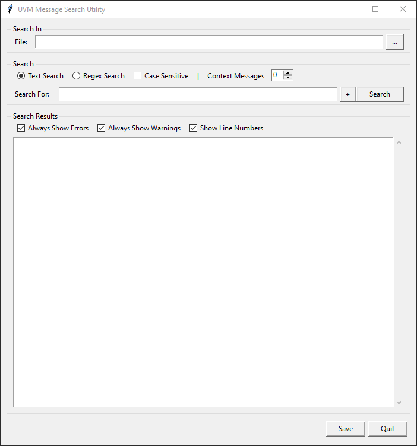

# SystemVerilog UVM Message Search Utility

Cross platform, Python 3 Tk based search utility to extract SystemVerilog UVM style message
from transcript files using one or more search terms.

### Python 3 Library Dependencies:

- argparse
- logging
- os
- sys
- tkinter
- traceback

### Usage:

```bash
./uvm_message_search.py [-h] [--debug]
```

### Options:

    -h, --help      Show the help message and exit
    --debug         Enables debug output mode

### Application Example


